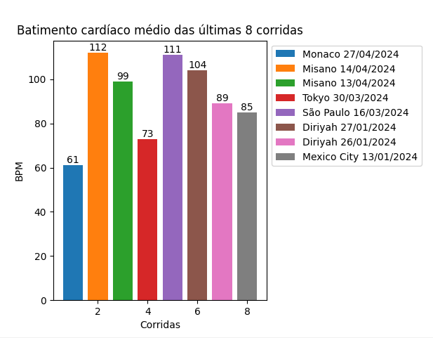

# 💻 Projeto: Monitoramento de Batimento Cardíaco

Este projeto busca armazenar os dados de batimento cardíaco do público que estiver assistindo a fórmula E ao vivo, através do relógio feito com arduino, e possibilitar as pessoas a enviar ideias inovadoras para melhorar os carros da Mahindra (ganhando recompensas caso a ideia chame a atenção da empresa). Esta implementação em python é usada como um banco de dados, realizando o armazenamento e tratamento de informações para apresentar ao usuário no site da SustenRace. Com isso, demostrariamos que, contrário ao que é falado, a fórmula E trás muita emoção para quem assiste.

## 🔨 Funcionalidades Principais
**1. Visualização de Batimentos Cardíacos:**

- Gera e exibe gráficos de batimentos cardíacos médios do público nas últimas corridas.

- Analisa a emoção das corridas com base nos batimentos cardíacos.

**2. Cadastro de Usuário:**

- O usuário deve cadastrar informações pessoais como nome, email, CPF, data de nascimento e telefone para conseguir mandar ideias.

- Oferece a opção de editar e atualizar os dados cadastrais.

**3. Envio de Ideias:**

- Os usuários podem enviar suas ideias para melhorar os carros da Mahindra.

- Armazena e exibe as ideias enviadas.

## 🧰 Tecnologias Utilizadas

- **Python:** Linguagem de programação principal para o desenvolvimento da aplicação.

- **Matplotlib:** Biblioteca utilizada para a criação de gráficos e visualizações de dados.

- **Funções:** Implementação de funções para verificar entrada de dados, gerar números e manipular listas.

- **Random:** Biblioteca responsável por gerar números aleatórios. No momento ela está sendo utilizada para simular
a captação de dados dos BPM das pessoas, pelo relógio em arduino, gerando números entre 60 e 120.

## 🔍 Detalhes do Código

**Estrutura do Projeto**

**funcoes.py:** Contém funções auxiliares para verificação de entradas, geração de dados e manipulação de listas.

**listas.py:** Inclui listas pré-definidas como opções de menu e dados das corridas.

**main.py:** Arquivo principal que integra todas as funcionalidades e controla o fluxo da aplicação.

## 💻 Detalhes do projeto

**1. Menu**

- **Perfil:** Acessa os dados cadastrais e histórico de ideias. Para isso, é necessário realizar o cadastro do usuário.

- **Pura Emoção - Batimentos Cardíacos:** Exibe gráficos e detalhes sobre os batimentos cardíacos em corridas.

- **Criar minhas ideias inovadoras:** Permite enviar novas ideias de melhorias para a Mahindra. Para isso, é necessário realizar o cadastro do usuário

## 🖥️ Requisitos - Dependências:

**Requisitos de Software:**

- Instalar o **[Python]**(https://www.python.org/) em sua máquina
- Possuir um editor de código - recomendamos o **[PyCharm]**(https://www.jetbrains.com/pt-br/pycharm/)

**Dependências:**

- matplotlib: Biblioteca responsável por gerar os gráficos
- random: Biblioteca para a geração de números aleatórios, que auxiliaram a criação dos gráficos

## 👩‍💻 Como Executar o Projeto

Após instalar os softwares necessários:

- Clone o repositório e navegue até o diretório pricipal
- Ou faça o download do código e abra a pasta no seu Pycharm
- Instale as bibliotecas listadas em "Dependências"
- Execute o código e explore todas as ações permitidas
- Caso tenha alguma dúvida sobre o código, leia os comantários explicativos ou entre em contato conosco

## 📊 Exemplo do Gráfico

## 🧑🏼‍🤝‍🧑🏻 Autores 
| Nome        | RM                                                       |
| ----------------- | ---------------------------------------------------------------- |
| Ali Andrea Mamani Molle                | 558052                                                   |
| Bruna da Costa Candeias                 | 558938                                              |
| Laura Souza de Carvalho                 | 556320                                              |
| Queren da Silva Prates                 | 558769                                            |
| Sofia Fernandes                | 554873                                                     |

**💚 SustenRace: Emoção sem prejudicar o planeta.**
